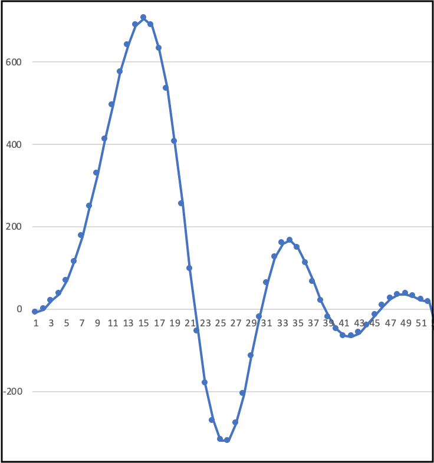

# Signal analyzer

Vyvinuli sme aplikáciu, ktorá zabezpečí pomoc lekárovi pri vyhodnocovaní výsledkov neuromonitoringu. Porgram analyzuje dáta a upozorní lekára na možné komplikácie pred alebo počas operácie. 

Ako prvý sme vytvorili generátor, ktorý generuje prúd dát s podobnými vzormi a tým simuluje reálne meranie pri vyšetrení pacienta. Vytvorené dáta sa následne analyzujú na dvoch úrovniach. Prvá staticky vyhľadáva hodnoty, ktoré prekročia stanovenú hodnotu a tým určuje miesta, kde sa pravdepodobne nachádzajú simulované vlny neurosignálov. Druhá úroveň pomocou natrénovaného modelu neurónovej siete vyhodnotí o aký typ impulzu sa jedná.

## Generátor dát
Tento modul aplikácie simuluje činnosť externých meracích zariadení používaných pri neurofyziologických vyšetreniach. Tieto zariadenia merajú činnosť nervov a svalov pacientov – zachytávajú nervové impulzy, ktoré sú reprezentované vlnami v grafe. Postupnosť jednotlivých vĺn a artefaktov môže používateľ ručne ovládať príkazmi. Na základe týchto príkazov sa v reálnom čase vygenerujú rôzne typy vĺn. 
Typy generovaných vĺn:

Po spustení generovania signálu naživo sa otvorí okno, ktoré v reálnom čase zobrazuje priebeh merania. Pre zobrazenie grafu používame balík matplotlib.pyplot, ktorý je určený pre grafické vytváranie dvojrozmerných grafov.

## Analyzátor signálov
Analýza signálu prebieha samostatne pre každé meranie, nezávisle na ostatných. Každé meranie sa analyzuje postupne pre každý jeho bod. Ak hodnota bodu presiahne prah pre nejaký hľadaný typ vlny, zisťuje sa, či sa nejedná o vrchol vlny. Analýza prebieha v troch krokoch:

Po identifikovaní zaujímavého miesta v meraní, sa toto miesto vysekne a posunie sa do neurónovej siete. Následnou klasifikáciou si zistí pravdepodonosť, s akou sa jedná o správnu vlnu. 

### Neurónová sieť

