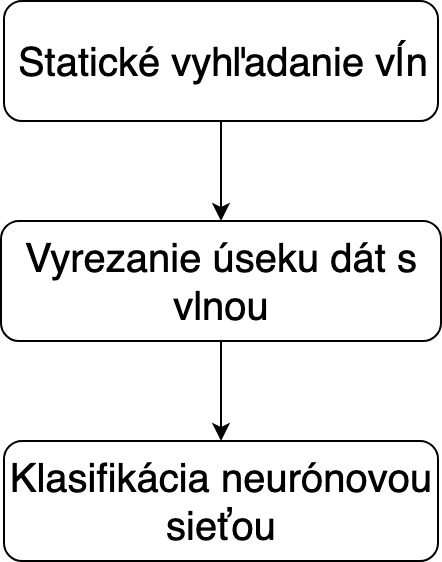

# Signal analyzer

[Slovak](README.sk.md) version

We have developed an application that will help the doctor to evaluate the results of neuromonitoring. The porgram analyzes the data and alerts the physician of possible complications before or during surgery.

First we have created a generator that generates a stream of data with similar patterns and thus simulates a real measurement at patient examination. The created data are then analyzed at two levels. The first statically searches for values that exceed a specified value, thereby determining where the simulated neurosignal waves are likely to be located. The second level uses a trained neural network model to evaluate the type of impulse.

## Data generator
This application module simulates the operation of external measuring devices used in neurophysiological examinations. These devices measure the activity of patient's nerves and muscles - they capture the nerve impulses that are represented as waves in the graph. The user can manually control the sequence of individual waves and artifacts by commands. These commands generate different types of waves in real time.
Types of generated waves:

When live signal generation is started, a window opens that shows the measurement progress in real time. To display the graph we use the package *matplotlib.pyplot*, which is designed for graphical creation of two-dimensional graphs.

## Signal analyzer
Patient measurement data is a stream of data, where each point is representing the measured value over time. Several measurements can be performed at the same time, but for each measurement each point is analyzed independently of the others. If the point value exceeds the threshold for a particular wave type, we suppose that it is the wave top. The analysis is carried out in three steps:

After identifying the point of interest in the measurement, the area around it is cut out and moved into the neural network. Subsequent classification will determine the likelihood of the correct wave. 

### Neural network
We used Genann library to construct neural network based classifier. It is a small library, but it fulfills all the conditions for proper functioning of small neural networks. Because it is simple and implemented in C, it is characterized by its speed.

#### Network training, testing and evaluation
We created a CVS file with generated waveforms. 50,000 images were correct waves and 50,000 images contained only noise. We have divided this large dataset into some subdatasets - training, testing and validation.

Then we created a network using a scenario:
1. Create a new neural network object
2. Loading individual datasets
3. Start network training
4. Result evaluation after network validation

We have repeated these steps 20 times and selected the best network according to the requirements:
* The average, best, and worst number of epochs in one of the sessions
* The average, best and worst duration of one of your workouts
* The worst and best network in terms of percentage validation success

The training itself consisted of a gradual launch of training periods. One epoch in network training consists of going through all the frames in the network training file. The epoch continues to run the test function, which returns the success of the current setting. If this success rate is less than 100%, it continues with another epoch. If the success rate does not reach the limit of 100% but the number of epochs started exceeds the maximum set number, the training will be terminated.

A value of 1 or 0 is specified for each frame, depending on whether it is a wave or noise. Testing and validation is evaluated as a correctly classified image if the neural network estimates its content with a tolerance of 0.1 for that image. Otherwise, the image is considered poorly classified.

## License
This project was created as a part of diploma thesis at FIIT STU. May 2019.
