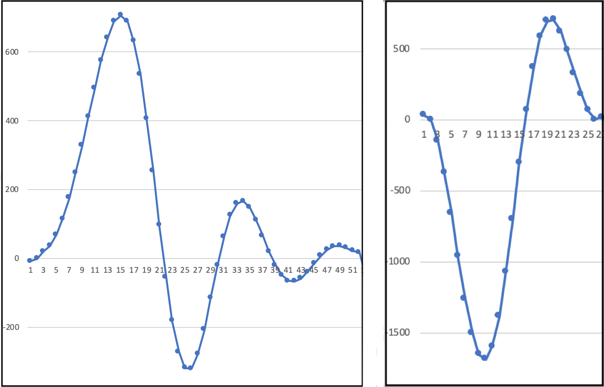

# Signal analyzer

Vyvinuli sme aplikáciu, ktorá zabezpečí pomoc lekárovi pri vyhodnocovaní výsledkov neuromonitoringu. Porgram analyzuje dáta a upozorní lekára na možné komplikácie pred alebo počas operácie. 

Ako prvý sme vytvorili generátor, ktorý generuje prúd dát s podobnými vzormi a tým simuluje reálne meranie pri vyšetrení pacienta. Vytvorené dáta sa následne analyzujú na dvoch úrovniach. Prvá staticky vyhľadáva hodnoty, ktoré prekročia stanovenú hodnotu a tým určuje miesta, kde sa pravdepodobne nachádzajú simulované vlny neurosignálov. Druhá úroveň pomocou natrénovaného modelu neurónovej siete vyhodnotí o aký typ impulzu sa jedná.

## Generátor dát
Tento modul aplikácie simuluje činnosť externých meracích zariadení používaných pri neurofyziologických vyšetreniach. Tieto zariadenia merajú činnosť nervov a svalov pacientov – zachytávajú nervové impulzy, ktoré sú reprezentované vlnami v grafe. Postupnosť jednotlivých vĺn a artefaktov môže používateľ ručne ovládať príkazmi. Na základe týchto príkazov sa v reálnom čase vygenerujú rôzne typy vĺn. 
Typy generovaných vĺn:

Po spustení generovania signálu naživo sa otvorí okno, ktoré v reálnom čase zobrazuje priebeh merania. Pre zobrazenie grafu používame balík matplotlib.pyplot, ktorý je určený pre grafické vytváranie dvojrozmerných grafov.

## Analyzátor signálov
Dáta z merania pacienta sú tvorené prúdom dát, pričom každý bod predstavuje nameranú hodnotu v čase. Súčasne môže prebiehať aj niekoľko meraní ale pre každé meranie sa analyzuje každý bod nezávisle od ostatných. Ak hodnota bodu presiahne prah pre nejaký hľadaný typ vlny, zisťuje sa, či sa nejedná o vrchol vlny. Analýza prebieha v troch krokoch:

Po identifikovaní zaujímavého miesta v meraní, sa toto miesto vysekne a posunie sa do neurónovej siete. Následnou klasifikáciou si zistí pravdepodonosť, s akou sa jedná o správnu vlnu. 

## Neurónová sieť
Pre zostrojenie klasifikátoru založeného na neurónovej sieti, sme použili knižnicu Genann. Je to malá knižnica, ktorá ale spĺňa všetky podmienky kladané na správne fungovanie malých neurónových sietí. Keďže je jednoduchá a implementovaná v jazyku C, vyznačuje sa svojou rýchlosťou.

## Trénovanie, testovanie a validácia siete
Vytvorili sme CVS súbor s vygenerovanými snímkami vĺn. 50 000 snímok bolo správnych a 50 000 sníkoch obsahovalo len šum. Tento veľký dataset sme rozdelili do trochu poddatasetov - trénovací, testovací a validačný.

Následne sme vytvárili sieť pomocou scenáru:
1. Vytvorenie nového objektu neurónovej siete
2. Načítanie jednotlivých datasetov
3. Spustenie tréningu siete
4. Vyhodnotenie výsledku po validácii siete

Tieto kroky sme opakovali 20-krát a vybrali sme najlepšiu sieť podľa požiadaviek:
* Priemerný, najlepší a najhorší počet epoch jedného z tréningov
* Priemerný, najlepší a najhorší čas trvania jedného z tréningov
* Najhoršiu a najlepšiu sieť z pohľadu percenta úspešnosti pri validácii

Samotné trénovanie pozostávalo z postupného spúšťania epoch trénovania. Jedna epocha v trénovaní siete pozostáva z prejdenia všetkých snímok v súbore na ktorých sa sieť trénuje. Epocha pokračuje v následnom spustení testovacej funkcie, ktorá vráti úspešnosť aktuálneho nastavenia. Ak je táto úspešnosť menšia ako 100%, pokračuje sa ďalšou epochou. Ak úspešnosť nedosahuje hranicu 100% ale počet spustených epoch presiahol maximálny nastavený počet, trénovanie sa ukončí.

Pre každú snímku je zadaná hodnota 1 alebo 0, podľa toho či sa jedná o vlnu alebo šum. Pri testovaní a validácii sa vyhodnocuje ako správne klasifikovaná snímka vtedy, ak neurónová sieť pre danú snímku odhadne jej obsah s toleranciou 0.1. Inak sa považuje snímka za zle klasifikovanú.

## Licencia
Tento projekt bol vytvorený v rámci diplomovej práce na FIIT STU. Máj 2019.
